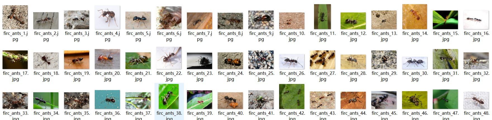
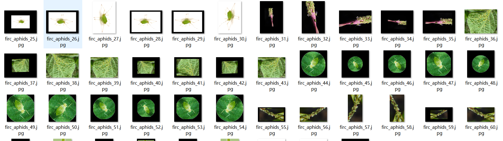
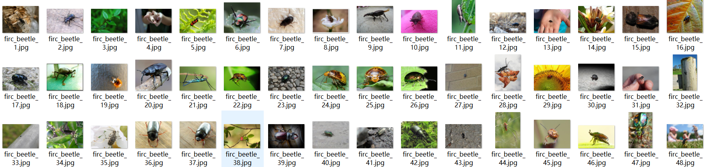
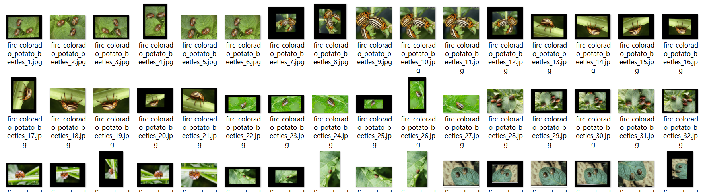
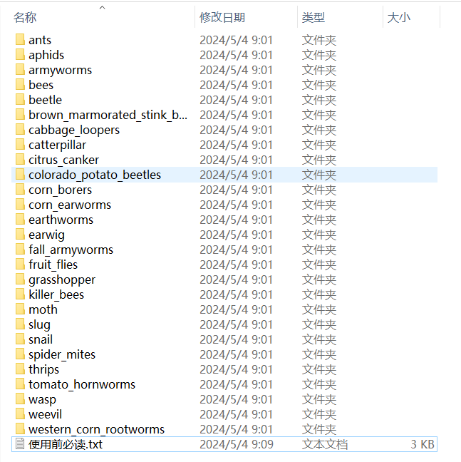
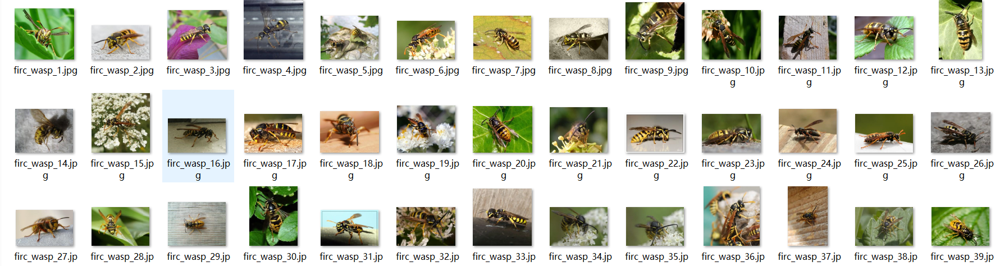

# 【Classification Dataset】Crops Pest Classification Dataset

- Dataset Type:
Image classification dataset, not suitable for object detection without labeled files.

Dataset Format: Pascal VOC + YOLO (excluding the split-path txt file; only jpg images with corresponding VOC-format xml files and YOLO-format txt files)
Only contains JPEG images, each category folder contains corresponding images.

### Image Count (JPEG File Count): 12846

### Number of Categories: 27

#### Category Names:
["ants", "aphids", "armyworms", "bees", "beetle", "brown_marmorated_stink_bugs", "cabbage_loopers", "catterpillar", "citrus_canker", "colorado_potato_beetles", "corn_borers", "corn_earworms", "earthworms", "earwig", "fall_armyworms", "fruit_flies", "grasshopper", "killer_bees", "moth", "slug", "snail", "spider_mites", "thrips", "tomato_hornworms", "wasp", "weevil", "western_corn_rootworms"]

### Chinese Names:
{

"ants":"Ant "

"aphids":"Aphid"

"armyworms":"glueInsect "

"bees":"Bee "

"beetle":"Beetle "

"brown_marmorated_stink_bugs":"brown marmorated stink bug"

"cabbage_loopers":"cabbage looper"

"catterpillar":"Caterpillar"

"citrus_canker":"citrus canker"

Colorado Potato Beetles: Colorado potato beetles

"corn_borers":"corn borers"

"corn_earworms":"corn earworms"

"earthworms":"Earthworm "

"earwig":"earrings"

"fall_armyworms":"fall armyworm"

"fruit_flies":"fruitFly "

"grasshopper":"Locust Insect "

"killer_bees":"killer bee"

"moth":"Flying Moth "

"slug":"turbidity

"snail":"Snail "

"spider_mites":"spider mite"

"thrips":"Thrips"

"tomato_hornworms":"tomato hornworm"

"wasp":"yellow bee "

Weevil: "Porcupine"

"western_corn_rootworms":"Western corn rootworms"
}

### Each Category Image Count:
- ants: 499 images
- aphids: 473 images
- armyworms: 480 images
- bees: 500 images
- beetle: 415 images
- brown_marmorated_stink_bugs: 502 images
- cabbage_loopers: 486 images
- catterpillar: 434 images
- citrus_canker: 498 images
- colorado_potato_beetles: 510 images
- corn_borers: 500 images
- corn_earworms: 497 images
- earthworms: 323 images
- earwig: 465 images
- fall_armyworms: 456 images
- fruit_flies: 483 images
- grasshopper: 485 images
- killer_bees: 495 images
- moth: 497 images
- slug: 391 images
- snail: 500 images
- spider_mites: 492 images
- thrips: 491 images
- tomato_hornworms: 504 images
- wasp: 497 images
- weevil: 482 images
- western_corn_rootworms: 491 images

## Importance Note: No guarantee is provided regarding the accuracy or precision of the trained models or weight files from this dataset. This dataset only provides accurate and reasonable classification storage.
## Images

---

Here is a pay link on Stripe (https://buy.stripe.com/3cs8yP7sY87d0vu9AB). Please contact me lonlonago@foxmail.com after funding $89, and I will send you a complete data files, thank you!

